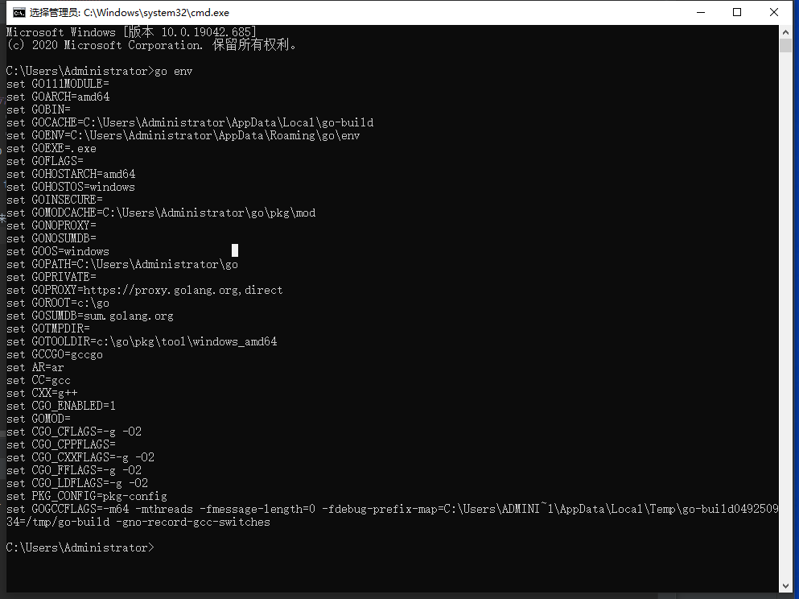

# go
go语言杂项工具

### go mod使用方法
  1、创建环境变量（系统变量）GO111MODULE=on/auto，如果已存在则忽略 
        1.13+的版本判断开不开启MODULE的依据是根目录下有没有go.mod文件，window下设置
            set GO111MODULE=on
        go module的目的是依赖管理，所以使用go module时可以舍弃go get命令（但是不是禁止使用，如果要指定报的版本或者更新包可使用go get，平时没有必要使用）
        因为go的网络问题，所以推荐使用goproxy.cn

        **初始化**
        为你的项目第一次使用GO MODULE（项目中还没有go.mod文件）
        进入你的项目文件夹 cd xxxx/xxxx/test
        初始化go module
        go mod init test（test为项目名称）
        命令执行成功之后，我们会发现在项目的根目录会出现一个go.mod文件
        注意，此时的go.mod文件只标识了项目名和go的版本，这是正常的，因为只是初始化了

        检测依赖
        go mod tidy
        tidy命令会检测该文件夹目录下所有引入的依赖，并写入go.mod文件
        写入后你会发现go.mod文件有所变动
            例如：
            module test

            go 1.13
            
            require (
            github.com/gin-contrib/sessions v0.0.1
            github.com/gin-contrib/sse v0.1.0 // indirect
            github.com/gin-gonic/gin v1.4.0
            github.com/go-redis/redis v6.15.6+incompatible
            github.com/go-sql-driver/mysql v1.4.1
            github.com/golang/protobuf v1.3.2 // indirect
            github.com/jinzhu/gorm v1.9.11
            github.com/json-iterator/go v1.1.7 // indirect
            github.com/kr/pretty v0.1.0 // indirect
            github.com/mattn/go-isatty v0.0.10 // indirect
            github.com/sirupsen/logrus v1.2.0
            github.com/ugorji/go v1.1.7 // indirect
            golang.org/x/sys v0.0.0-20191025021431-6c3a3bfe00ae // indirect
            gopkg.in/yaml.v2 v2.2.4
            )
        此时我们就可以使用这些依赖了
  2、创建环境变量（系统变量）GOPROXY=goproxy.cn，因默认的代理无法访问导致下载包失败。如果已存在则忽略 
  3、在需要使用go mod的文件下打开console，然后使用go mod init 模块名，来初始化go mod

  4、使用go mod tidy 来清理无用的包引用

  5、使用go env来查看环境变量配置是否正确，如下图显示
    ，该例中需要修改gopath地址和，并且开启go module
  
  6、使用外部包之前先使用 go get -u github.com/gin-gonic/gin命令获取包，该包保存在gopath的src目录中
  
  7、